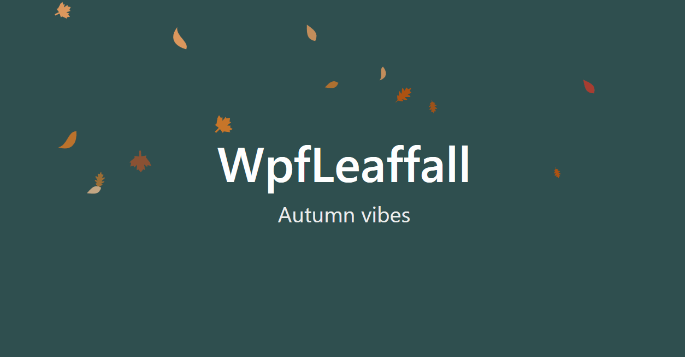




<h1 align="center">WpfSeasonalAnimations</h1>
<p align="center">
 Add seasonal animations in your apps with customizable wpf controls.
</p>
<p align="center">
 Based on <a href="https://github.com/Marplex/WpfSnowfall">WpfSnowfall</a>
</p>
<br>

<p align="center">
  <a href="https://github.com/nafrolov/WpfSeasonalAnimations/blob/main/LICENSE"></a>
  <a href="https://github.com/nafrolov"></a> 
</p>

# Features

- [x] Snowfall with different snowflakes
- [x] Leaf fall with different tree leaves and wind gusts, leaf ground accumulation
- [x] Fully customizable

# Available for

<br/>
<br/>
<br/>

# How to use

## Snowfall

Include WpfSnowfall user control in your layout. For more info view the `Demo` project.

```xml
<sf:Snowfall
    EmissionRate="5"
    Fill="White"
    ScaleFactor="1.1"
    OpacityFactor="1"
    LeaveAnimation="Fade"
    ParticleSpeed="1" />
```

#### Customize

| Property      	| Description                                                        	| Default 	|
|---------------	|--------------------------------------------------------------------	|---------	|
| EmissionRate  	| How many snowflakes to emit every second                           	| 5       	|
| ScaleFactor   	| Scale in/out snowflakes. Higher values generates bigger snowflakes 	| 1.0     	|
| OpacityFactor 	| Snowflake opacity                                                  	| 1.0     	|
| ParticleSpeed 	| Snowflake fall speed                                               	| 1.0     	|
| Fill          	| Snowflake color                                                    	| White   	|
| LeaveAnimation        | Snowflake leave animation                                          	| Fade    	|

## Leaf fall

Include LeafFallControl in your layout. For more info view the `Demo` project.

```xml
<lf:LeafFallControl
    EmissionRate="2"
    ScaleFactor="1.6"
    OpacityFactor="0.9"
    ParticleSpeed="0.5"
    LeaveAnimation="Fade"
    Wind="0.2"
    Gustiness="0.3"
    AccumulateOnGround="True"
    GroundLevel="0.9"
    MaxGroundLeaves="150"
    GroundFadeSeconds="0"/>
```

#### Customize

| Property           | Description                                                          | Default 	| Recommended Range of values  |
|---------------     |--------------------------------------------------------------------  |---------	| ---------------------------  |
| EmissionRate       | How many leaves to emit every second                                 | 5      	| 2...15                       |
| ScaleFactor        | Scale in/out leaves. Higher values generates bigger leaves    	    | 1.0     	| 0.6...2.0                    |
| OpacityFactor      | Leaf opacity                                                         | 1.0     	| 0.5...1.0                    |
| ParticleSpeed      | Leaf fall speed                                                      | 1.0     	| 0.5...2.0                    |
| Fill               | Leaf color. If null, each leaf uses random color from autumn palette | null      | -                            |
| LeaveAnimation     | Leaf leave animation                                          	    | Fade    	| -                            |
| Wind               | Horizontal wind strength in px/frame                            	    | 0.0    	| 0.0...3.0                    |
| Gustiness          | How much the wind fluctuates over time (0 = still, 1 = very gusty)   | 0.4   	| 0...1                        |
| AccumulateOnGround | Whether leaves should pile up at the bottom instead of vanishing     | True    	| -                            |
| GroundLevel        | Where the leaves accumulate relative to control(0 = top, 1 = bottom) | 1.0    	| 0.85...0.95                  |
| MaxGroundLeaves    | Maximum number of leaves that can rest on the ground            	    | 0     	| 50...150                     |
| GroundFadeSeconds  | If > 0, ground leaves fade out over this many seconds after landing  | 0     	| 0...6                        |

# 📜 License

```xml
Copyright (c) 2026 nafrolov

Permission is hereby granted, free of charge, to any person obtaining a copy
of this software and associated documentation files (the "Software"), to deal
in the Software without restriction, including without limitation the rights
to use, copy, modify, merge, publish, distribute, sublicense, and/or sell
copies of the Software, and to permit persons to whom the Software is
furnished to do so, subject to the following conditions:

The above copyright notice and this permission notice shall be included in all
copies or substantial portions of the Software.

THE SOFTWARE IS PROVIDED "AS IS", WITHOUT WARRANTY OF ANY KIND, EXPRESS OR
IMPLIED, INCLUDING BUT NOT LIMITED TO THE WARRANTIES OF MERCHANTABILITY,
FITNESS FOR A PARTICULAR PURPOSE AND NONINFRINGEMENT. IN NO EVENT SHALL THE
AUTHORS OR COPYRIGHT HOLDERS BE LIABLE FOR ANY CLAIM, DAMAGES OR OTHER
LIABILITY, WHETHER IN AN ACTION OF CONTRACT, TORT OR OTHERWISE, ARISING FROM,
OUT OF OR IN CONNECTION WITH THE SOFTWARE OR THE USE OR OTHER DEALINGS IN THE
SOFTWARE.
```